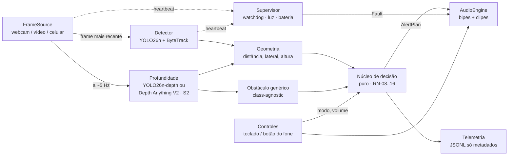
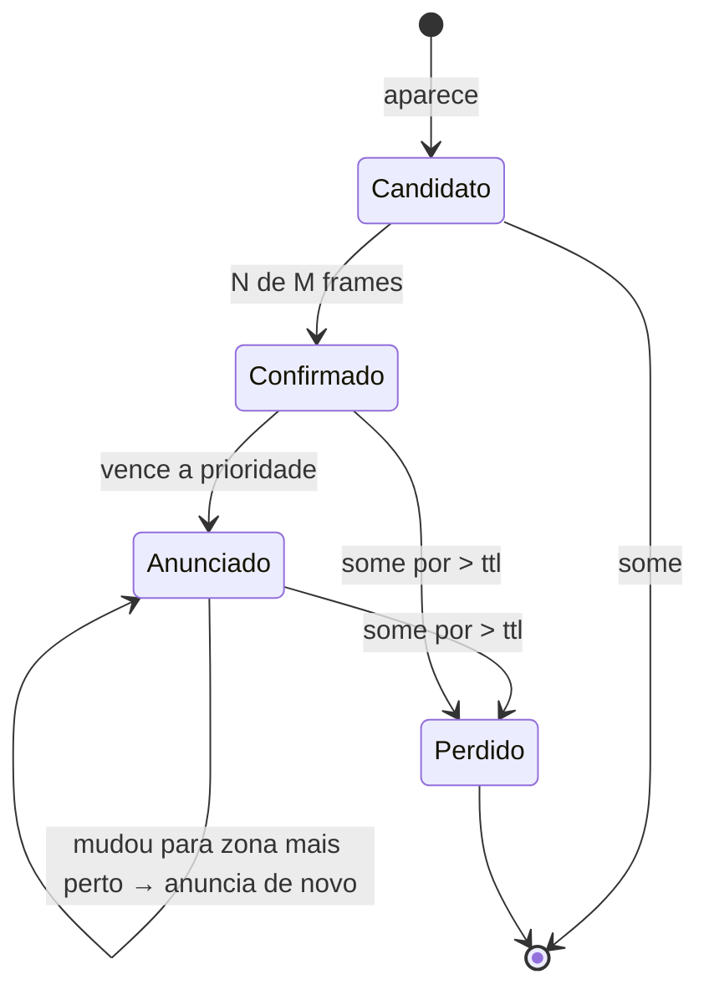
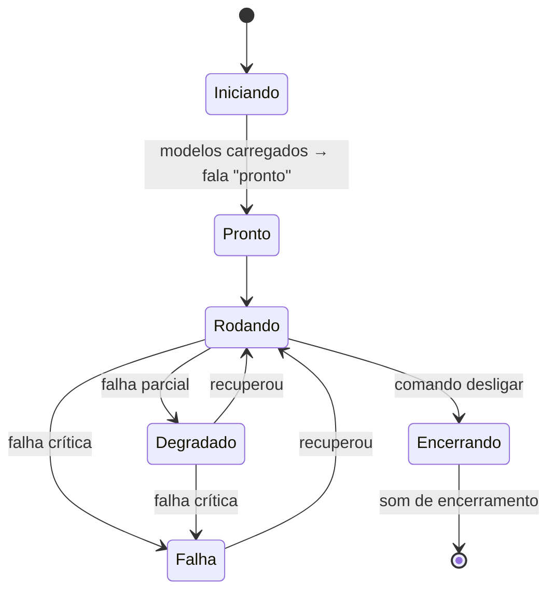

# Arquitetura — Detecção de Obstáculos para Acessibilidade

22/09/2026 · complementa o [Plano Detalhado v2](plano.md). As regras citadas como RN-xx estão lá.

## 1. Restrições que moldam a arquitetura

Vêm das respostas de 22–23/09 (seção 1.1 do plano):

| Restrição | Consequência na arquitetura |
| --- | --- |
| Cegueira total, alvo = cabeça/peito + pessoas | Saída 100% sonora. A percepção precisa estimar **altura** do obstáculo, não só distância. |
| Todo lugar, todo horário | Nada de regra específica de um ambiente. Tratar pouca luz explicitamente (RN-27). |
| R$ 0 de hardware agora | Fases 1–4 sem sensor: distância vem **só da câmera** (geometria + modelo de profundidade). |
| Sem GPU; PC de mesa Ryzen + notebook i3 + 2× Redmi 13C (Helio G85) | Inferência em CPU → modelos pequenos, runtime otimizado por máquina (perfis `pc` / `notebook` / `celular`). |
| Fone com fio em um ouvido só; usa TalkBack; não entende "relógio" | Áudio mono (direção por voz ou timbre); controle pelo botão do fone; convivência com TalkBack. |
| Python forte, Flutter forte, ML zero | Laboratório em Python; app final em Flutter; ML usado "de prateleira" o máximo possível. |
| Prefere não rotular dados | Caminho **geométrico** que detecta obstáculo sem saber a classe (reduz a Fase 4) e avaliação por **eventos**, não por caixas. |
| Portfólio + uso real, repo público | Código limpo, testado, com métricas reproduzíveis e CI. |

## 2. Princípios

1. **Núcleo funcional, casca imperativa.** Toda a lógica de decisão (RN-08 a RN-16) é código puro: recebe percepções, devolve decisões. Nada de câmera, áudio, relógio do sistema ou `print` lá dentro. É isso que torna o sistema testável e portável para Dart.
2. **Parâmetros fora do código.** Todo valor entre colchetes das RNs mora em `shared/config/params.yaml`. Calibrar = editar config, não código. Python e Dart leem o mesmo arquivo.
3. **Frame mais recente vence.** Nunca enfileirar frames. Se a inferência atrasar, descarta o velho e processa o mais novo (latência > throughput, RN-03).
4. **Silêncio nunca é ambíguo.** Um supervisor independente vigia o pipeline e toca o som de falha (RN-04).
5. **Sem imagens persistidas.** Em runtime só saem metadados (RN-28). Testes usam *traces* de detecções, não vídeo.
6. **Na dúvida, alerta.** Toda regra de filtro que puder esconder um obstáculo real tem uma exceção de segurança (ex.: objeto cortado pela borda = Perto).

## 3. Visão geral



Três camadas:

- **Percepção** (pesada, com IO): frame → lista de `Perception` (o que, onde em metros, a que altura).
- **Decisão** (pura, leve): `Perception[]` + estado anterior + modo → `AlertPlan`.
- **Saída** (IO de áudio): `AlertPlan` → som, com preempção e descarte de mensagem velha.

O **Supervisor** fica fora do fluxo principal, de propósito: se o pipeline travar, ele continua vivo.

## 4. Percepção

### 4.1 Detector semântico

- **YOLO26n** pré-treinado no COCO (Fases 1–3) — ~31% mais rápido em CPU que o YOLO11n e sem NMS no pós-processamento (ADR-015). Classes fora do COCO: primeiro **YOLOE-26 com prompts de texto** (spike S6), fine-tuning só do que faltar (Fase 4). Fontes em [referencias.md](referencias.md).
- Exportado para **ONNX Runtime** (CPU). Máquina de desenvolvimento: **Ryzen 5 5600GT** (6 núcleos / 12 threads, Zen 3, vídeo integrado Radeon Vega 7). OpenVINO descartado: roda em AMD, mas é otimizado para Intel. Entrada **320 px** como ponto de partida (spike S1 decide).
- Opção extra: **ONNX Runtime + DirectML** usa o vídeo integrado Vega 7 no Windows. Candidato a rodar a profundidade e liberar a CPU para o YOLO (testar no S2).
- **ByteTrack** (embutido no Ultralytics) dá ID estável por objeto → base da persistência (RN-11) e da anti-repetição (RN-14).
- Filtra por `shared/config/classes.yaml` (RN-16): só classes de mobilidade passam.

**Perfis de máquina** (`shared/config/perfis/*.yaml`, sobrepõem `params.yaml`):

| Perfil | Máquina | Runtime | Profundidade | Uso |
| --- | --- | --- | --- | --- |
| `pc` | Ryzen 5 5600GT (desktop) | ONNX Runtime (+ DirectML) | Ligada | Desenvolvimento, Fases 1–2, avaliação em vídeo |
| `notebook` | i3 7ª geração | **OpenVINO** (Intel) | **Desligada** | Teste de campo 3a na mochila |
| `celular` | App Flutter (Redmi 13C, Helio G85) | LiteRT via `tflite_flutter` | Começa desligada; liga a 1–2 Hz se o S4 permitir (seção 11.1) | Fases 5 e 3b |

Com a profundidade desligada pelo perfil, o caminho geométrico (4.3) não roda e o supervisor **não** trata isso como falha — a RN-34 vale só quando a profundidade deveria estar ligada.

### 4.2 Distância e posição 3D (sem hardware)

Duas fontes, combinadas:

**a) Geometria pinhole por classe** (rápida, a cada frame). Para classes com altura real conhecida (pessoa ≈ 1,65 m, carro ≈ 1,5 m, cadeira ≈ 0,9 m):

```text
distância  d = f · H_real / h_px
lateral    x = (u_centro − cx) · d / f          → metros à esquerda/direita
altura     y = y_cam + (cy − v) · d / f         → altura do ponto acima do chão
```

`f`, `cx`, `cy` vêm da calibração da câmera (`tools/calibrate_camera.py`, uma vez por câmera). `y_cam` = altura da câmera no corpo dela (config).

**b) Modelo de profundidade** (lento, assíncrono, ~5 Hz). Dá profundidade densa para todo pixel, inclusive de coisas que o YOLO não conhece (galho, placa, orelhão). Roda numa thread própria; o resultado é usado se tiver menos de [250 ms]. Dois candidatos, decididos no spike S2 (ADR-015):

| Candidato | Saída | Custo | A favor |
| --- | --- | --- | --- |
| **YOLO26n-depth** | **Metros** (cabeça log-depth, 0,02–150 m) | 6,3 M parâmetros; 272 ms em CPU a 768 px → precisa rodar menor | Mesmo pacote e export do detector; suportado pelo plugin Flutter oficial |
| **Depth Anything V2 Small** | Relativa (há variantes métricas: interno até 20 m, externo) | ~25 M parâmetros; LiteRT INT8 de 27,7 MB, entrada fixa 518×686 | Muito testado; Apache-2.0 |

**Fusão:** se a classe tem altura conhecida, a geometria manda e o mapa de profundidade é **reescalado** para concordar com ela (corrige o erro de escala do modelo monocular). Sem referência na cena, usa o valor métrico do modelo direto — por isso um modelo que já sai em metros (YOLO26n-depth) é preferível.

**Exceções de segurança** (viram RN-33/RN-34 no plano):

- Caixa encostando na borda superior ou inferior da imagem = objeto cortado = **Perto**, independentemente da conta (um objeto cortado sempre parece mais longe do que está).
- Sem profundidade válida (modelo atrasado > [500 ms]) → estado degradado, som de falha leve.

> **Correção de inclinação:** as contas de altura assumem câmera com inclinação conhecida. Na Fase 1 o ângulo é medido uma vez e vai para a config. No app (Fase 5), o acelerômetro dá o ângulo real a cada frame.

### 4.2.1 Campo de visão: por que celular em retrato, não webcam

Câmera no peito a **~1,12 m** (ela tem 1,55 m, ombro 1,25 m). Ângulo vertical necessário para ver cada alvo a **1 m** de distância:

| Alvo | Altura | Ângulo a partir da câmera |
| --- | --- | --- |
| Topo da faixa cabeça | 1,70 m | **+30°** (para cima) |
| Mesa / tampo | 0,75 m | **−20°** (para baixo) |

Precisa de ~50° de campo vertical, centrado um pouco para cima.

- **Webcam de notebook** (paisagem): campo vertical típico de ~40–45°. Não cobre os dois ao mesmo tempo; nivelada, perde obstáculo de cabeça a 1 m — justamente o caso principal.
- **Celular em retrato:** campo vertical típico de ~60–70°. Com inclinação de **~+10°** para cima, cobre de −23° a +43°. Resolve.

Decisão: **Fase 1 já usa celular em retrato no peito via DroidCam** (ADR-011). `calibrate_camera.py` mede o campo de visão real e confirma a conta.

**Posição da câmera é configuração, não código.** Nos testes ela aceita o celular no peito; no uso diário quer algo discreto (U8). Posições alternativas (bolso da camisa, alça da bolsa, cordão) mudam só `camera.altura_m` e `camera.inclinacao_graus` — e, no app, o acelerômetro corrige a inclinação a cada frame. Posições que balançam muito (alça da bolsa) pioram o tracking; isso é medido quando chegar a hora, com os mesmos vídeos + `eval.py`.

### 4.3 Obstáculo genérico (class-agnostic)

É a peça que ataca o problema principal dela **sem treinar nada**:

1. Recorta do mapa de profundidade a região do **corredor** (RN-08) na faixa de altura **peito–cabeça** (RN-09).
2. Converte em nuvem de pontos com as fórmulas acima.
3. Se houver um aglomerado de pontos com mais de [N] pixels mais perto que [1,5 m] → emite `Perception(classe="obstáculo", ...)`.
4. Se esse aglomerado coincide com uma caixa do YOLO, vira aquela classe (ex.: "pessoa"). Se não, fica "obstáculo".

Resultado: um galho na altura da cabeça gera bipe mesmo sem existir a classe "galho". A Fase 4 passa a ser **melhoria** (dar nome ao obstáculo), não pré-requisito de segurança.

### 4.4 Tipos

Implementados em [`lab/src/visao/core/types.py`](../lab/src/visao/core/types.py).

```python
@dataclass(frozen=True)
class Perception:
    track_id: int | None      # None para obstáculo genérico
    cls: str                  # chave de classes.yaml, ou "obstaculo"
    conf: float
    distance_m: float
    lateral_m: float          # + direita, − esquerda
    top_m: float              # altura do topo do objeto
    bottom_m: float           # altura da base
    truncated: bool           # encosta na borda da imagem
    source: Literal["semantic", "geometric", "fused"]
    t_capture: float          # timestamp da captura do frame (monotônico)
```

## 5. Núcleo de decisão

Função pura:

```python
def decide(
    perceptions: list[Perception],
    state: CoreState,
    mode: Mode,
    now: float,
    params: Params,
) -> tuple[AlertPlan, CoreState]: ...
```

`now` entra como parâmetro (nada de `time.time()` lá dentro) → dá para reproduzir qualquer cena exatamente.

### 5.1 Etapas

| Ordem | Etapa | RN |
| --- | --- | --- |
| 1 | Descartar classes fora da lista e confiança abaixo do limiar por classe | RN-10, RN-16 |
| 2 | Corredor em **metros** (`abs(lateral_m) <= largura/2 + margem`) | RN-08 |
| 3 | Faixa de altura: `chão` / `tronco` / `cabeça` a partir de `top_m`/`bottom_m` | RN-09 |
| 4 | Zona pela distância; `truncated` força Perto | RN-12, RN-33 |
| 5 | Persistência por track (N de M frames) — Perto usa limiar menor | RN-11 |
| 6 | Prioridade: zona → faixa → centralidade → perigo da classe | RN-13 |
| 7 | Anti-repetição por track e zona; cooldown global de voz | RN-14, RN-15 |
| 8 | Aplicar modo (Caminhada / Explorar / Silencioso) | RN-20 |

### 5.2 Máquina de estados por objeto



### 5.3 Saída

```python
@dataclass(frozen=True)
class AlertPlan:
    beep: BeepSpec | None       # contínuo enquanto o alvo existir
    speech: SpeechSpec | None   # evento pontual
    t_capture: float            # herdado da percepção → mede latência e descarta velho

@dataclass(frozen=True)
class BeepSpec:
    rate_hz: float              # Perto ≈ 8, Atenção ≈ 3
    band: Band                  # chão / tronco / cabeça → tom grave / médio / agudo
    side: Literal["esq", "frente", "dir"]       # vira timbre (fone mono) ou pan (fone estéreo), conforme params.audio.saida

@dataclass(frozen=True)
class SpeechSpec:
    clip_keys: tuple[str, ...]  # ex.: ("pessoa", "frente")
    priority: int
```

**Design sonoro — decidido com ela em 23/09/2026 ([relatório](testes-campo/2026-09-23-fase0.5.md)): opção B.** O **ritmo** diz a distância, o **tom** diz a altura (agudo = cabeça), e o **timbre** diz o lado — tom limpo = frente, "tic" agudo = esquerda, "toc" grave = direita (`beep_with_side_timbre`, `lab/src/visao/audio/synth.py`). A voz só nomeia o objeto, sem repetir o lado. Ela usa **fone em um ouvido só** (U7), então isso substitui o estéreo.

A opção A (lado só na voz) fica reservada para o modo Explorar, sem a pressa do alerta reflexo.

O `side` do `BeepSpec` é abstrato: o `AudioEngine` o transforma em timbre (`audio.saida: mono`, o caso dela) ou em pan (`audio.saida: estereo`), conforme a config. Trocar de fone não muda o núcleo.

## 6. Saída de áudio

- **Bipes sintetizados em tempo real** (`sounddevice`, callback com buffer pequeno ~10 ms). O callback lê o `BeepSpec` atual; trocar o spec muda o som no próximo buffer, sem clique. Saída **mono** por padrão (um ouvido só).
- **Voz = clipes pré-renderizados.** `tools/gen_audio.py` usa **Piper** (voz pt-BR, offline) para gerar um `.wav` por palavra do vocabulário (nomes de classe, direções, mensagens do sistema). Em runtime só toca arquivo: latência mínima, zero dependência de TTS no celular.
- **Prioridades:**

| Nível | Evento | Comportamento |
| --- | --- | --- |
| P0 | Falha (RN-04) | Interrompe tudo; repete a cada [3 s] até resolver |
| P1 | Alerta Perto | Interrompe voz em andamento |
| P2 | Confirmação de controle (troca de modo, volume) | Curta; não interrompe P0/P1 |
| P3 | Alerta Atenção | Espera; descartado se ficar velho |
| P4 | Informação (modo Explorar) | Espera; descartado se ficar velho |

- **Descarte de mensagem velha** (RN-06): antes de tocar, compara `now − t_capture` com [500 ms].

## 7. Supervisor (fail-safe)

Thread independente, com relógio próprio:

| Checagem | Condição de falha | Ação |
| --- | --- | --- |
| Captura viva | último frame há > [500 ms] | Fault "câmera" |
| Inferência viva | fps < [5] em janela de 2 s | Fault "lento" |
| Profundidade | resultado mais novo > [500 ms] | Degradado (só semântico) |
| Exceção em qualquer thread | qualquer | Fault "erro" |
| Luminosidade | brilho médio < [limiar] por 1 s | Aviso "pouca luz" (RN-27) |
| Bateria (Fase 5) | 20% / 10% / crítico | Aviso / Fault (RN-24) |

Estados globais do sistema:



## 8. Concorrência e orçamento de latência

Threads (Python):

| Thread | Faz | Frequência |
| --- | --- | --- |
| Captura | Lê a câmera e sobrescreve um slot "último frame" | fps da câmera (30) |
| Principal | Detecção → geometria → decisão → publica `AlertPlan` | o mais rápido possível |
| Profundidade | Modelo de profundidade (S2) no frame mais recente | ~5 Hz |
| Áudio | Callback do `sounddevice` + player de clipes | 100 Hz (buffer 10 ms) |
| Supervisor | Checagens da seção 7 | 10 Hz |

O YOLO e o ONNX Runtime liberam o GIL durante a inferência, então as threads rodam em paralelo de fato.

**Orçamento para RN-03 (≤ 300 ms, captura → som):**

| Etapa | Estimativa (notebook, CPU) | Medido (PC, Ryzen 5 5600GT — spike S1, 23/09) |
| --- | --- | --- |
| Exposição + leitura da câmera | ~35 ms | ~35 ms (estimativa; sem captura de verdade ainda) |
| YOLO26n 320 px (ONNX Runtime; sem NMS) | ~15–35 ms | **8,6 ms médio, p95 10,1 ms** (115,8 fps) |
| Tracking + geometria + decisão | < 5 ms | < 5 ms |
| Persistência (2 de 3 frames na zona Perto) | ~130 ms (a ~15 fps) | ~66 ms (a ~30 fps — o detector não é mais o limitador) |
| Buffer de áudio | ~10–20 ms | ~10–20 ms |
| **Total** | **~195–225 ms** | **~120–145 ms** |

No PC, o YOLO26n deixou de ser o gargalo — sobra folga de verdade para a RN-03 (300 ms). No notebook (i3), o spike S1b (ainda não rodado) decide se o mesmo vale lá; pela diferença de CPU, é bem provável que não. Detalhe completo do S1 em [testes-campo/2026-09-23-spike-s1.md](testes-campo/2026-09-23-spike-s1.md).

## 9. Avaliação e testes

### 9.1 Níveis de teste

| Nível | O que testa | Dados | Onde roda |
| --- | --- | --- | --- |
| Unitário | Cada etapa do núcleo, geometria, config | Sintéticos | CI (GitHub Actions) |
| **Trace (golden)** | Núcleo completo: sequência de percepções → alertas esperados | `shared/traces/*.jsonl` (só metadados) | CI, Python **e** Dart |
| Avaliação em vídeo | Pipeline inteiro, métricas da RN-30 | Vídeos locais (fora do git) | Local, antes de cada teste com ela |
| Campo | Uso real com ela | Protocolo da Fase 3 | Presencial |

### 9.2 Rotulagem por eventos (barata)

Em vez de desenhar caixas, cada vídeo de avaliação tem um JSON com **intervalos**:

```json
{"video": "corredor_03.mp4", "events": [
  {"t_start": 3.2, "t_end": 5.0, "zona": "perto", "faixa": "cabeca", "lado": "frente"}
]}
```

`tools/label_events.py` toca o vídeo e você aperta uma tecla quando o obstáculo entra/sai da zona. Uns 2 minutos por vídeo.

Métricas (`tools/eval.py`):

- **Recall de eventos Perto:** % de eventos em que houve bipe Perto até [300 ms] depois do `t_start`.
- **Falsos alarmes/min:** bipes Perto fora de qualquer evento.
- **Latência p50/p95** e **fps**, das marcas de tempo da telemetria.

### 9.3 Traces como contrato entre Python e Dart

1. `tools/record_trace.py` roda o pipeline num vídeo e grava as `Perception` de cada frame (JSONL, sem imagem).
2. O núcleo Python gera os `AlertPlan` esperados → arquivo `.expected.jsonl`.
3. Na Fase 5, o núcleo Dart roda os mesmos traces e precisa produzir **exatamente** os mesmos planos.

Isso garante que o port para o celular não muda o comportamento validado com ela.

## 10. Estrutura do repositório

```text
visao/
├── docs/
│   ├── plano.md                 ← Plano Detalhado v2
│   ├── arquitetura.md           ← este arquivo
│   ├── adr/                     ← uma decisão por arquivo (seção 12)
│   └── testes-campo/            ← relatório de cada sessão com ela
├── shared/                      ← fonte única para Python e Dart
│   ├── config/
│   │   ├── params.yaml          ← todos os [ ] das RNs
│   │   ├── perfis/              ← pc.yaml, notebook.yaml, celular.yaml (ADR-013)
│   │   └── classes.yaml         ← classe → nome pt-BR, perigo, altura típica, conf mínima
│   ├── audio/                   ← vocabulario.yaml + .wav gerados pelo Piper (fora do git)
│   └── traces/                  ← traces golden + .expected.jsonl
├── lab/                         ← Python (Fases 0.5–4)
│   ├── pyproject.toml
│   ├── src/visao/
│   │   ├── capture/             ← FrameSource: CameraFrameSource (webcam/DroidCam), arquivo
│   │   ├── perception/          ← detector, tracker, depth, geometry, generic
│   │   ├── core/                ← núcleo puro: decide(), estados, tipos
│   │   ├── audio/               ← beeps, clipes, prioridade
│   │   ├── supervisor/
│   │   ├── controls/
│   │   ├── telemetry/
│   │   └── app.py               ← liga tudo
│   ├── tools/
│   │   ├── audio_test.py        ← Fase 0.5
│   │   ├── gen_audio.py
│   │   ├── calibrate_camera.py
│   │   ├── record_session.py
│   │   ├── label_events.py
│   │   ├── record_trace.py
│   │   └── eval.py
│   └── tests/
├── training/                    ← notebooks Colab, dataset.yaml (Fase 4)
├── mobile/                      ← Flutter (Fase 5)
└── data/                        ← .gitignore: vídeos, datasets, pesos
```

**Ferramentas Python:** Python 3.12, `uv` (ambiente e dependências), `ruff` (lint/format), `pytest`, `pyright` no modo básico. CI no GitHub Actions roda lint + unitários + traces (não precisa de GPU nem de vídeo).

**Arquivos de configuração** (já criados no repositório):

| Arquivo | Conteúdo |
| --- | --- |
| [`shared/config/params.yaml`](../shared/config/params.yaml) | Todos os valores `[ ]` das RNs, com o número da regra em comentário |
| [`shared/config/perfis/`](../shared/config/perfis/) | `pc.yaml`, `notebook.yaml`, `celular.yaml` (ADR-013) |
| [`shared/config/classes.yaml`](../shared/config/classes.yaml) | Classe do modelo → chave de fala, perigo, altura típica, confiança mínima |
| [`shared/audio/vocabulario.yaml`](../shared/audio/vocabulario.yaml) | Toda palavra falada (direções, objetos, mensagens do sistema) |

Os testes de `lab/tests/test_config.py` garantem, no CI, que os perfis sobrepõem a base corretamente e que toda classe tem um clipe de fala no vocabulário.

## 11. Fase 5 — arquitetura no celular (Flutter)

**App 100% Flutter/Dart** (ADR-014): sem Kotlin escrito à mão. Tudo via pacotes do pub.dev.

```mermaid
flowchart LR
    CAM[camera<br/>image stream YUV] --> PRE
    subgraph Isolate de percepção
      PRE[Pré-processamento<br/>YUV → tensor 320 px] --> YOLO[ultralytics_yolo ou tflite_flutter<br/>YOLO26n · GPU]
      PRE -->|1 a cada N frames| DEP[Profundidade<br/>escolhida no S2]
      YOLO --> GEO[Geometria + tracking]
      DEP --> GEO
    end
    GEO -->|Perception[] via SendPort| CORE
    subgraph Isolate principal
      CORE[Núcleo Dart<br/>port de core/] --> AUD[flutter_soloud<br/>bipes + clipes]
      SUP[Supervisor] --> AUD
      IMU[sensors_plus<br/>inclinação] --> GEO
      BT[Botão do fone com fio<br/>audio_service] --> CORE
      UI[UI mínima acessível<br/>TalkBack]
    end
    FGS[flutter_foreground_task<br/>mantém o app vivo] -.-> CORE
```

- **Câmera:** pacote `camera` com `startImageStream` (frames YUV). Nunca enfileirar: se o isolate de percepção estiver ocupado, o frame novo **substitui** o pendente (princípio 3).
- **Inferência:** candidato preferido é o plugin oficial **`ultralytics_yolo`**: faz câmera + inferência LiteRT com GPU em código nativo já pronto, suporta YOLO26 **incluindo a tarefa de profundidade**, e você só escreve Dart. Os modelos que ele baixa sozinho usam 640×640; para o Helio G85, exportar os nossos em resolução menor. Alternativa: `tflite_flutter` (LiteRT via FFI) com GPU delegate num **isolate**. Decidir no S4.
- **Conversão YUV → tensor:** é o gargalo clássico do Flutter. Fazer direto na resolução de entrada (320 px), sem gerar imagem RGB cheia, e medir no S4. Se passar de ~15 ms, usar `opencv_dart` (FFI) para a conversão.
- **Núcleo e áudio em Dart:** o port do `core/` é pequeno (algumas centenas de linhas) e validado pelos traces da seção 9.3. O supervisor também é Dart, no isolate principal (vigia o isolate de percepção por heartbeat).
- **Plano B só se um spike falhar:** um plugin Kotlin mínimo, só para a peça que falhou (ex.: câmera com tela desligada). O resto continua em Flutter.
- **Controles sem tela (RN-36):** **botão do fone com fio**, recebido como evento de mídia via `audio_service` (MediaSession), que funciona com a tela apagada. Grátis e o fone já é o da RN-05. Botões de volume **não** servem: com a tela apagada e o TalkBack ligado, o sistema fica com eles. Com patrocínio, um controle Bluetooth de selfie entra pelo mesmo canal de mídia.
- **TalkBack (RN-35):** ela usa. Toda tela com `Semantics` rotulados, poucos botões grandes, testada com TalkBack ligado. Risco: o TalkBack **abaixa o volume de outros áudios** enquanto fala (ex.: lendo uma notificação), o que abafaria um bipe de obstáculo. Mitigação: sugerir "Não perturbe" ao entrar no modo Caminhada e medir o efeito no S5.
- **Tela desligada:** `flutter_foreground_task` com serviço do tipo `camera`, iniciado com o app em primeiro plano. Precisa de spike (S3) no celular dela.
- **Xiaomi (MIUI/HyperOS):** a Xiaomi é conhecida por matar apps em segundo plano mesmo com foreground service. Na instalação: liberar "Início automático", pôr economia de bateria em "Sem restrições" e travar o app na tela de recentes. O app deve **detectar quando foi morto** e, ao voltar, avisar por voz; o supervisor não consegue tocar som se o processo inteiro morreu, então isso entra no S3.

### 11.1 O celular dela: Redmi 13C

A linha 13C tem duas versões, com desempenho bem diferente:

| Versão | Processador | Expectativa (estimativa, S4 confirma) |
| --- | --- | --- |
| **13C 4G** (a mais vendida no Brasil) | MediaTek Helio G85, GPU Mali-G52 MC2 | Fraco. YOLO26n 320 px deve rodar a ~10–15 fps com GPU (estimativa). Profundidade provavelmente ~1–2 Hz → obstáculo genérico degradado. Aquece em uso longo. |
| 13C 5G | MediaTek Dimensity 6100+ | Melhor. YOLO com folga; profundidade talvez a 3–4 Hz. |

**Confirmado (22/09): é a versão 4G, Helio G85.** Consequências:

1. O perfil `celular` começa **igual ao `notebook`** (YOLO + pinhole, profundidade desligada ou a 1–2 Hz só para o caminho genérico da cabeça, com margem maior).
2. Opções para a profundidade, a testar no S4: YOLO26n-depth ou Depth Anything V2 Small INT8 em resolução menor, ou profundidade só quando nada foi detectado no corredor. **ARCore Depth não é opção:** o Redmi 13C não está na lista de aparelhos com ARCore.
3. **Não há celular mais forte disponível**, mas há **dois Redmi 13C iguais**: um de desenvolvimento (câmera da DroidCam nas Fases 1–3a, app nas Fases 5 e 3b) e o dela, de uso diário. Vantagem: a calibração e os vídeos de avaliação saem do mesmo modelo de câmera. Ao instalar no aparelho dela, rodar `calibrate_camera.py` de novo (lentes do mesmo modelo variam um pouco).
4. **Obstáculo genérico na cabeça, no celular, depende do S4.** Se o G85 não rodar a profundidade nem a 1–2 Hz, esse recurso só existe no PC até vir patrocínio (celular melhor ou sensor ToF).
5. Por isso, a **demo para patrocinadores** é o PC rodando o pipeline completo (com obstáculo genérico) sobre vídeos gravados com o Redmi no peito dela: mostra o sistema inteiro funcionando e deixa claro o que falta de hardware.

Alternativa se o celular dela não aguentar: **Raspberry Pi 5** rodando o próprio código Python de `lab/` — a arquitetura já suporta, é só trocar o `FrameSource` e adicionar o sensor ToF como mais uma fonte de distância.

## 12. Decisões de arquitetura (ADRs)

| ADR | Decisão | Alternativas descartadas | Por quê |
| --- | --- | --- | --- |
| 001 | Python como laboratório + port do núcleo para Dart na Fase 5, com traces como contrato | Só Python num Pi; Dart desde o início | Python acelera o ML; Flutter é onde você já é forte; traces garantem que nada muda no port |
| 002 | Núcleo de decisão puro e determinístico | Lógica espalhada no loop principal | Testável, reproduzível, portável |
| 003 | Parâmetros em YAML compartilhado | Constantes no código | Calibração sem mexer em código; mesma config nos dois lados |
| 004 | Captura "último frame vence" | Fila de frames | Fila acumula atraso; aqui atraso = batida |
| 005 | Distância por pinhole + Depth Anything V2 Small, sem sensor | Sensor ToF/ultrassom; câmera estéreo | Orçamento R$ 0; sensor volta com patrocínio como fonte extra |
| 006 | Dois caminhos de percepção: semântico (YOLO) + geométrico (profundidade) | Só YOLO | Cobre galho/placa/orelhão sem treinar; reduz a rotulagem |
| 007 | Avaliação por eventos (intervalos), não por caixas | Rotular bbox em cada frame | ~2 min por vídeo em vez de horas |
| 008 | Voz em clipes pré-gerados com Piper; bipes sintetizados | TTS em runtime (pyttsx3/gTTS) | Latência mínima, offline, igual no Python e no celular |
| 009 | Nenhuma imagem persistida em runtime; testes por traces de metadados | Gravar vídeo sempre | LGPD, privacidade de terceiros, repo público |
| 010 | Monorepo com `shared/` | Repos separados | Config, áudio e traces num só lugar |
| 011 | Câmera da Fase 1 = celular em retrato no peito (DroidCam), inclinado ~10° para cima | Webcam do notebook | Webcam não enxerga a faixa da cabeça a 1 m (seção 4.2.1); celular já antecipa a Fase 5 |
| 012 | Teste de campo em duas etapas: 3a com notebook i3 na mochila (USB + fone com fio, sem profundidade), depois app de celular, depois 3b completo | PC de mesa via Wi-Fi + Bluetooth; adiantar o app antes de qualquer teste | Wi-Fi + Bluetooth estoura a RN-03 e limita o alcance; esperar o app atrasaria o feedback dela em 1–2 meses |
| 013 | Perfis de máquina (`pc`, `notebook`, `celular`) sobre a config base | Branches ou flags soltas no código | Mesmo código em três máquinas; desligar a profundidade é configuração, não gambiarra |
| 014 | App 100% Flutter/Dart (`camera`, `tflite_flutter` ou `ultralytics_yolo`, isolates, `flutter_foreground_task`) | Câmera + inferência em Kotlin nativo | Afinidade com Flutter; custo de desempenho aceitável, medido no S4. Kotlin só como plano B pontual |
| 015 | Família YOLO26: YOLO26n (detecção), YOLO26n-depth (candidato de profundidade), YOLOE-26 (classes por texto) — *proposto, confirmar nos spikes* | YOLO11n; treinar classes novas logo | Mais rápido em CPU, sem NMS, profundidade em metros no mesmo toolchain, classes novas sem rotular |

Cada ADR tem um arquivo próprio em [adr/](adr/README.md), com contexto, alternativas e consequências.

## 13. Spikes (validar antes de se comprometer)

| # | Pergunta | Como testar | Fase | Se falhar |
| --- | --- | --- | --- | --- |
| ~~S1~~ | ✅ **115,8 fps** (8,6 ms médio) — bem acima da meta de 15 fps | `tools/bench.py --imgsz 320` | 1 | — |
| S1b | YOLO26n roda a ≥ 10 fps no i3 7ª geração com OpenVINO? A bateria aguenta ~1h30 de sessão? | Mesmo benchmark no notebook + teste de bateria | Antes da 3a | Entrada 256 px; sessões mais curtas ou notebook na tomada com extensão no corredor |
| S2 | **YOLO26n-depth × Depth Anything V2 Small**: qual roda a ≥ 5 Hz junto com o YOLO e erra menos em metros? A que resolução? | Benchmark CPU × DirectML (Vega 7) + 20 medidas com trena, dentro e fora de casa | 2 (1º dia) | Reduzir resolução; ou só pinhole até ter sensor |
| S3 | Com Flutter puro (`camera` + `flutter_foreground_task`), a câmera continua com a tela desligada no Redmi 13C? A Xiaomi mata o app? | App Flutter mínimo, 30 min de tela desligada | 5 (1º dia) | Tela ligada em brilho mínimo; ou plugin Kotlin mínimo só para isso |
| S4 | No Redmi 13C: YOLO a ≥ 10 fps (`tflite_flutter` × `ultralytics_yolo`)? YUV → tensor < 15 ms? Profundidade a quantos Hz? Em **30 min** (sessão máxima dela, RN-26): gasta ≤ 20% de bateria e mantém o fps sem estrangular por calor? | App mínimo + medição de temperatura | 5 | Perfil sem profundidade; usar o seu celular no 3b |
| S6 | **YOLOE-26** com prompts de texto ("tree branch", "street sign", "pole", "awning", "open door", "phone booth"…) acha os obstáculos de cabeça nos vídeos dela? Custa quanto a mais que o YOLO26n? | `eval.py` com os eventos rotulados, recall por classe; fps no PC e no i3 | 2 | Treinar essas classes na Fase 4 com o dataset ROD + fotos próprias |
| S5 | `flutter_soloud` toca bipe (com troca de timbre) e latência < 50 ms? Com TalkBack ligado, o bipe é abafado quando o TalkBack fala? O botão do fone chega ao app com a tela apagada? | App mínimo, com TalkBack ligado | 5 | Clipes pré-gerados; "Não perturbe" obrigatório no modo Caminhada; controle BT |

## 14. O que é construído em cada fase

| Fase | Componentes |
| --- | --- |
| 0.5 | `audio/synth.py` + `player.py` + `vocab.py` (bipes, playback, vocabulário), `gen_audio.py`, `audio_test.py`. A fila de prioridade P0–P4 (RN-06) entra na Fase 1, com o `AudioEngine` que consome `AlertPlan` |
| 1 | `core/decide.py` + `state.py` ✅ · `capture/` ✅ (`LatestFrameSlot`, `FakeFrameSource`) · `CameraFrameSource` ✅ (webcam/DroidCam via OpenCV, testado de verdade com a DroidCam do PC — 21 fps) · spike S1 ✅ · `perception/detector.py` ✅ (produz `Detection`, ainda sem distância — geometria é Fase 2) · `supervisor/` ✅ (RN-04, RN-27, RN-34 — bateria fica para a Fase 5) · `controls/` ✅ (teclado, RN-20 a RN-22) · `telemetry/` ✅ (RN-28) · `audio/engine.py` ✅ (fila P0–P4, RN-06/RN-15/RN-17, duas threads — bipe e voz — que o SO mixa; validado sem exceção/deadlock, qualidade do som ainda por ouvir com calma) — falta: `calibrate_camera.py`, `record_session.py`, `label_events.py`, `record_trace.py`, `eval.py` |
| 2 | `perception/depth`, `perception/geometry` com fusão, `perception/generic`, spikes S2 e S6 |
| 3a | Perfil `notebook` + export OpenVINO, spike S1b, calibração de `params.yaml`, relatórios em `docs/testes-campo/` |
| 5 | `mobile/` inteiro, perfil `celular`, spikes S3–S5 |
| 3b | Só calibração + relatórios |
| 4 | Só o que o YOLOE (S6) não resolveu: `training/`, dataset ROD + fotos próprias, novo peso, novas entradas em `classes.yaml` |

Ordem de execução: 0.5 → 1 → 2 → **3a → 5 → 3b** → 4 (ADR-012).

## 15. Pendências que afetam a arquitetura

**Status (23/09): nenhuma pendência bloqueante.** A única pergunta aberta é a forma discreta de carregar no uso diário (U8), que só muda configuração (seção 4.2.1) e é decidida na Fase 5. O resto é respondido pelos spikes S1–S5.

| # | Pergunta | Afeta |
| --- | --- | --- |
| ~~U13~~ | ✅ 1,55 m, ombro 1,25 m → faixas e câmera já na config (seção 10) e seção 4.2.1 | — |
| ~~—~~ | ✅ Tem celular para usar como câmera no peito na Fase 1 (DroidCam) | ADR-011 confirmado |
| ~~U9~~ | ✅ **Redmi 13C 4G, Helio G85** (fraco) — seção 11.1 | Perfil `celular` começa sem profundidade; S4 |
| ~~—~~ | ✅ Celular da DroidCam = Redmi 13C; há 2 aparelhos iguais (dev + dela). Não há aparelho mais forte | Seção 11.1 itens 3–5 |
| ~~—~~ | ✅ Ryzen 5 5600GT → ONNX Runtime (+ DirectML no Vega 7 como opção) | S1, S2 |
| ~~—~~ | ✅ Teste de campo: opção A (ADR-012) — 3a com notebook i3, depois app, depois 3b | Ordem das fases |
| ~~U7~~ | ✅ Fone com fio com botão, um ouvido só → áudio mono, controle pelo botão | Seções 5.3, 6, 11 |
| ~~U2~~ | ✅ Não entende posição de relógio → "esquerda / frente / direita" | Vocabulário dos clipes |
| ~~U10~~ | ✅ Máximo 30 min seguidos → RN-26 e S4 medem sessão de 30 min | S4 |
| U8 | 🟡 Nos testes, peito ok; no dia a dia quer algo discreto | Só config de câmera (4.2.1); decidir na Fase 5 |
